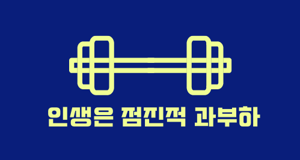
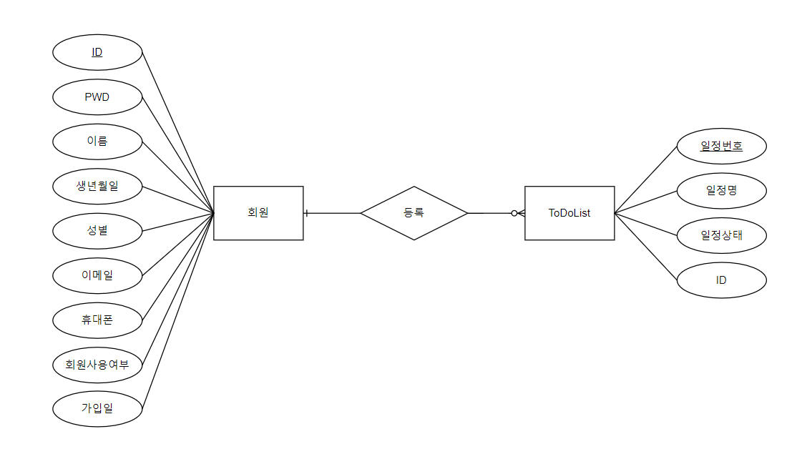
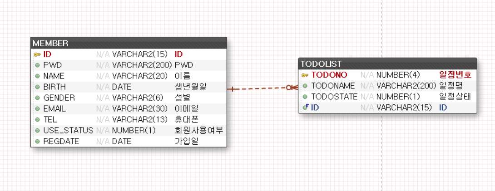
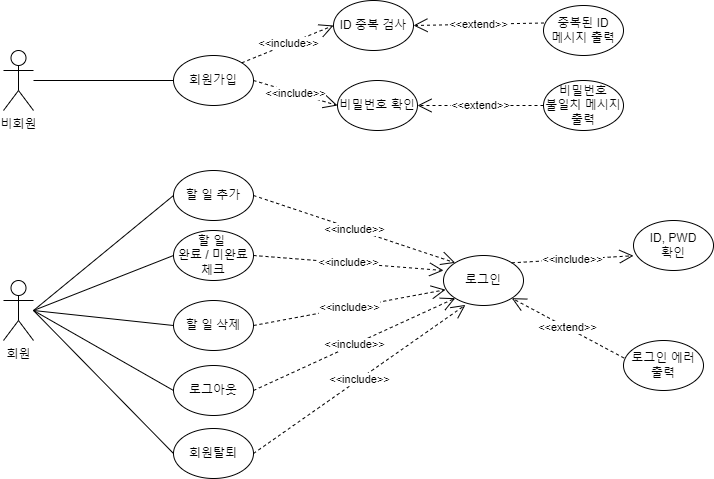
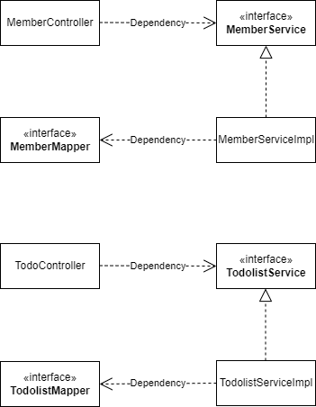
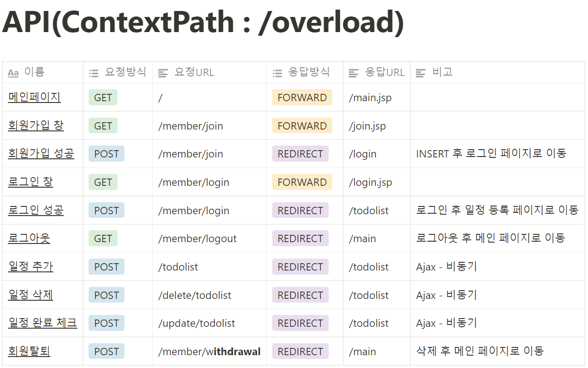
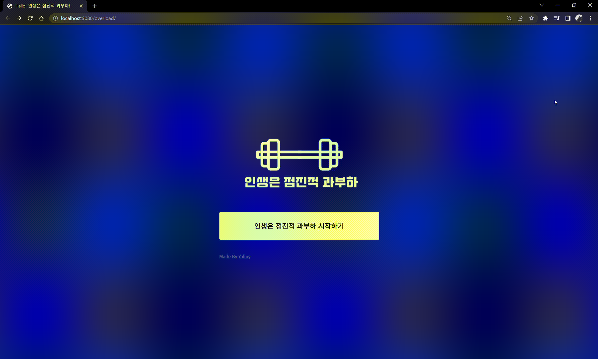
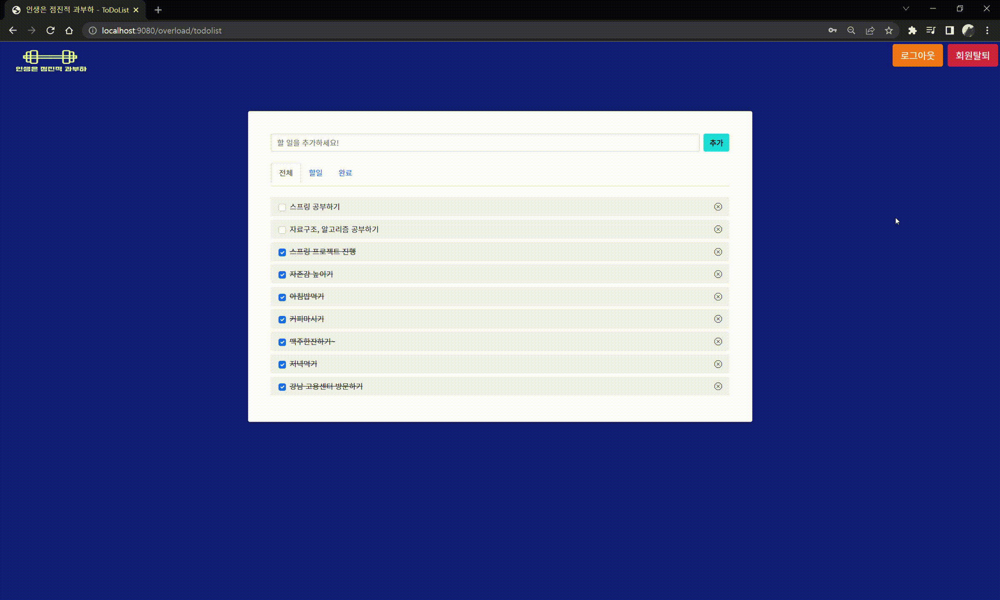
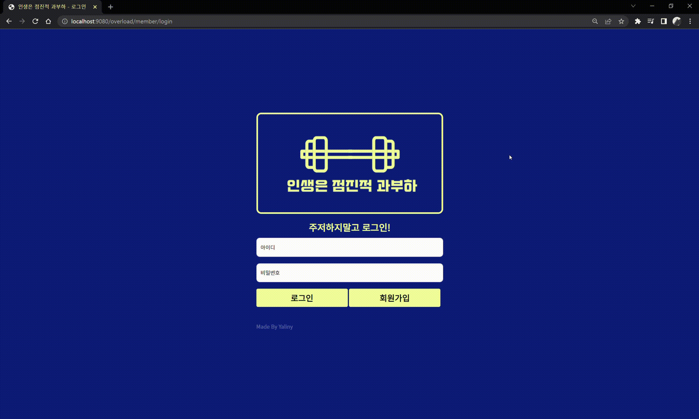
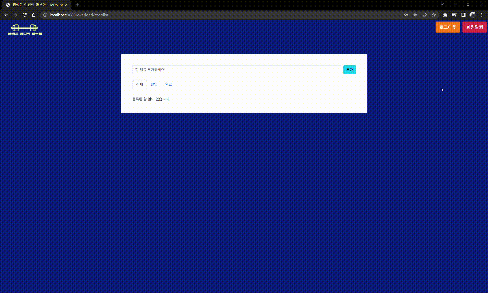

# Spring Project - TODOLIST
## 스프링 개인 프로젝트 - TODOLIST(인생은점진적과부하)

   
  
   

 

## 📃 목차
1. 프로젝트 소개
2. 요구분석
3. DB 모델링
4. 다이어그램
5. API
6. 기능 구현
7. 느낀점

  

## 📚 1. 프로젝트 소개
👉 <a href="">영상으로 보러가기</a> 

   
  
   

### 📚 프로젝트 동기/개요
- '인생은 점진적 과부하'는 오늘 할 일을 내일로 미루지 않고 어제보다 나은 내일의 내가 될 수 있도록 성장하자는 의미입니다.
- 할 일을 추가하고 완료한 일은 체크를 하면서 자신이 꼭 해야하는 일을 관리할 수 있는 todolist 프로젝트 입니다.
- 국비지원학원에서 간단하게 스프링을 배운 뒤 개인적으로 스프링에 대한 이해도가 어느 정도인지 파악하고 부족한 부분은 직접 공부하고 싶은 생각에 간단한 개인 토이 프로젝트를 진행하게 되었습니다.
- 평소에도 자주 사용하는 todolist를 프로젝트 주제로 선정하게 되었습니다.
  
### 🔨 기술 스택
  
  

 

 

 

 

### 👪 프로젝트 참여자
- 박예린
  
  

## 📝 2. 요구분석
### 1) 회원가입
    - 회원가입을 할 때 이름, 생년월일, 성별, 이메일, 휴대폰 번호를 입력받는다.
    - ID는 영어+숫자 조합으로 최소 6자 ~ 최대 15자
    - PW는 소문자, 대문자와 특수기호 1개는 필수 최소 8자 ~ 최대 20자

### 2) 로그인
    - 로그인 성공시 할 일 목록을 보여주는 todolist 페이지로 이동한다.
    - 로그인 실패시 경고창을 띄워준다.(ex. 존재하지 않은 ID, 일치하지 않는 PWD)

### 3) 전체 목록과 완료한 일, 할 일을 볼 수 있도록 탭이 나눠져 있다.
    - 모든 탭에서는 할 일 추가 및 삭제가 가능하다.
    - 체크 박스로 완료 처리 또는 미완료 처리가 가능하다.
    - 완료한 일은 전체 목록에서 취소선으로 보여진다.
    - 일정상태 컬럼에서 해야할 일은 0으로 완료한 일은 1로 관리한다.
  
### 4) 회원 탈퇴가 가능하다.
    - 회원사용여부 컬럼에서 사용 가능한 회원은 0, 탈퇴한 회원은 1로 관리한다.
    - 탈퇴한 회원의 정보는 임의의 데이터로 수정되어진다.

 

## 📝 3. DB 모델링

### 📝 개념적 모델링

   
  
   

### 📝<a href="">논리적/물리적 모델링</a>

   
  
   

  

## 📝 4. 다이어그램
### 📝 유스케이스 다이어그램

   
  
   

### 📝 클래스 다이어그램

   
  
   

  

## 📝 5. API

   
  
   

  

## 💻 6. 기능 구현
👉 <a href="https://github.com/Yelin-park/SpringProject_TODOLIST/blob/main/todolist/src/main/java/org/todolist/controller/TodoController.java">TodoController 보러가기</a> 
👉 <a href="https://github.com/Yelin-park/SpringProject_TODOLIST/blob/main/todolist/src/main/java/org/todolist/controller/MemberController.java">MemberController 보러가기</a> 
👉 <a href="https://github.com/Yelin-park/SpringProject_TODOLIST/blob/main/todolist/src/main/resources/org/todolist/mapper/TodolistMapper.xml">TodolistMapper.xml 보러가기</a> 
👉 <a href="https://github.com/Yelin-park/SpringProject_TODOLIST/blob/main/todolist/src/main/resources/org/todolist/mapper/TodolistMapper.xml">MemberMapper.xml 보러가기</a> 
👉 <a href="https://github.com/Yelin-park/SpringProject_TODOLIST/tree/main/todolist/src/main/webapp/WEB-INF/views">View 보러가기</a> 
👉 <a href="https://github.com/Yelin-park/SpringProject_TODOLIST/tree/main/todolist/src/main/java/org/todolist/domain">domain 보러가기</a> 
👉 <a href="https://github.com/Yelin-park/SpringProject_TODOLIST/tree/main/todolist/src/main/java/org/todolist/service">service 보러가기</a> 
### 회원가입

- 회원가입시 스프링 시큐리티에서 제공하는 클래스 중 BCryptPasswordEncoder를 사용하여 비밀번호를 암호화(encode 메서드 사용) 하였습니다.
~~~ java
	@PostMapping("/join")
	public String join(MemberVO member) {
		log.info("회원가입 post 요청");
		
		String inputPass = member.getPwd();
		String pwd = pwdEncoder.encode(inputPass);
		member.setPwd(pwd);
		
		int result = memberService.join(member);
		
		log.info("회원가입 완료 수 " + result);
		
		if(result == 0) {
			return "redirect:/";
		} else {
			return "redirect:/member/login";
		}
	} // join
~~~
- ID 중복체크는 Ajax로 처리하였으며, /member/idCheck 라는 요청 URL로 POST 방식으로 요청을 하면 input 태그에 id value를 가지고 가서 DB에서 중복 체크를 한 뒤 중복된 아이디라면 1을 돌려주고 사용 가능한 ID라면 0을 돌려주어 클라이언트에게 메시지를 보여줍니다.
~~~ java
	// 아이디 중복검사
	$("#idCheck").on("click", function () {
		let id = $("#id").val();
		
		$.ajax({
				url : "/overload/member/idCheck",
				type : "post",
				data : {
					id : id
				},
				cache : false,
				success : function(result) {
					if (result == 1) {
						$('#msg_id_check').text('중복된 아이디 입니다.').css("color","red").css("font-weight", "bold");
					} else {
						$('#msg_id_check').text('사용할 수 있는 아이디 입니다.').css("color","green").css("font-weight", "bold");
					} 
				} 
			}); // ajax

	});
~~~
### 로그인

- 회원가입시 BCryptPasswordEncoder 클래스의 encode 메서드로 암호화한 비밀번호를 로그인 시에는 matches 메서드를 사용하여 인코딩 되지 않은 패스워드를 첫 번째 매개변수로 전달하고 인코딩 된 패스워드를 두 번째 매개변수로 전달하여 일치한다면 로그인이 가능하도록 구현했습니다.
- 먼저, 클라이언트가 입력한 ID를 체크한 뒤 존재하지 않는다면 경고창을 띄워 알려준다.
- ID가 존재한다면 mathces 메서드를 사용하여 비밀번호가 맞는지 확인 후 일치하지 않는다면 경고창을 띄워 알려준다.
- 로그인 하는 회원의 ID와 PWD가 모두 일치한다면 세션에 저장합니다.
~~~ java
	@PostMapping("/login")
	public String login(MemberVO member, HttpSession session, Model model) {
		log.info("로그인 post 요청");
				
		session.getAttribute("member");
		int result = memberService.idCheck(member.getId());
		
		if(result != 1) {
			log.info("로그인 실패 - 아이디 오류");
			model.addAttribute("msg", "idmiss");
			return "login";
		}
		
		MemberVO login = memberService.login(member);
		boolean pwdMatch = pwdEncoder.matches(member.getPwd(), login.getPwd());
		
		if(login != null && pwdMatch == true) {
			log.info("로그인 성공");
			session.setAttribute("member", login);
			return "redirect:/todolist";
		} else {
			log.info("로그인 실패 - 비밀번호 오류");
			model.addAttribute("msg", "pwdmiss");
			return "login";
		} 
	} // login
~~~
- 로그인을 하지 않은 상태로 todolist 페이지를 요청하는 경우 로그인 페이지로 리다이렉트 시킵니다.
- 로그인이 완료되면 세션에는 회원을, 모델에는 해당 회원의 해야할 일과 완료한 일을 DB에서 가져와 담은 뒤 todolist로 포워딩 시킵니다.
~~~ java
	@GetMapping("/todolist")
	public String todolist(HttpSession session, Model model) {
		log.info("todolist 페이지 진입");
		
		MemberVO member = (MemberVO) session.getAttribute("member");
		
		if(member == null) {
			log.info("로그인 X 로그인 페이지 리다이렉트");
			return "redirect:/member/login";
		} else {
			log.info("로그인 O todolist 페이지로 이동");
			
			session.setAttribute("member", member);
			
			List<TodolistVO> todoList = todolistService.todoList(member.getId());
			model.addAttribute("todoList", todoList);
			
			List<TodolistVO> completedList = todolistService.completedList(member.getId());
			model.addAttribute("completedList", completedList);
			
			return "todolist";
		} // if
		
	} // todolist
~~~
### 할 일 추가

- 세션에서 로그인한 회원의 ID를 가져온 뒤 todolist를 추가할 회원을 지정해줍니다.
- 할 일을 추가한 뒤 완료가 되면 todolist로 리다이렉트를 해주고 실패할 시 포워딩을 해줍니다.
~~~ java
	@PostMapping("/todolist")
	public String todolist(TodolistVO todolist, HttpSession session, Model model) {
		log.info("todolist 추가");
		
		MemberVO member = (MemberVO) session.getAttribute("member");
		todolist.setId(member.getId());
		
		int result = todolistService.addTodolist(todolist);
		
		if(result == 1) {
			log.info("todolist 추가 성공");
			return "redirect:/todolist";
		} else {
			log.info("todolist 추가 실패");
			return "todolist";
		} // if
		
	} // todolist
~~~

### 할 일 삭제 할 일 완료 체크(완료된 할 일은 미완료로 수정 가능)
- 할 일 완료/미완료에 대한 부분은 Ajax 처리를 하여 체크박스가 체크가 되어있다면 완료, 체크가 되어 있지 않다면 미완료로 수정합니다.
- 체크박스에 대한 체크값은 flag 변수에 true/false로 담아 Controller에서 완료는 1로 미완료는 0으로 변경하여 DB를 수정합니다.
- 할 일이 완료 또는 미완료로 수정이 되면 result 값에 UPDATE가 완료된 갯수를 담아 클라이언트에게는 완료된 할 일은 취소선으로, 미완료된 할 일은 취소선을 없앤 상태로 보여줍니다.

~~~ java
	// 체크박스 ajax 처리	
	$("input[type='checkbox']").on("click", function () {
			
		var flag = $(this).prop("checked");
		var todono = $(this).val();
			
		$.ajax({
			url : "/overload/update/todolist",
			type : "post",
			data : {
				"todono" : todono,
				"flag" : flag
			},
			cache : false,
			success : function(result) {
				if(result == 1){
					if (flag) {
						$(this).next("p").css("text-decoration", "line-through");
					} else {
						$(this).next("p").css("text-decoration", "none");
					}
						
					location.href = "${pageContext.request.contextPath}"+"/todolist";
				} else {
					alert("수정 실패");
				}
			} 
		}); // ajax
			
	});
~~~
~~~ java
	@PostMapping("/update/todolist")
	@ResponseBody
	public int update(@RequestParam int todono, @RequestParam boolean flag) {	
		int todostate  = flag ? 1 : 0;
		
		if(todostate == 1) {
			log.info("todono " + todono + "번 할 일 완료");
		} else {
			log.info("todono " + todono + "번 할 일 미완료");
		}
		
		todolist.setTodono(todono);
		todolist.setTodostate(todostate);
		
		int result = todolistService.uptodolist(todolist);
		return result;
	} // update
~~~
### 할 일 삭제
- 할 일을 삭제할 시 할 일을 보여주는 목록 부분만 리로드하면 되기 때문에 Ajax를 통해 처리합니다. 할 일 삭제가 완료되면 회원의 todolist를 다시 요청한 뒤 삭제가 완료된 후의 할 일 목록을 보여줍니다.
~~~ java
	// todolist 삭제
	function deltodolist(todono) {	
		$.ajax({
			url : "/overload/delete/todolist",
			type : "post",
			data : {
				todono : todono
			},
			cache : false,
			success : function(result) {
				if (result == 1) {
					location.href = "${pageContext.request.contextPath}"+"/todolist";
				} else {
					alert("삭제 실패");
				} 
			} 
		}); // ajax
	}
~~~
~~~ java
	@PostMapping("/delete/todolist")
	@ResponseBody
	public int delete(@RequestParam("todono") int todono) {
		log.info("todono " + todono + "번 삭제");
		int result = todolistService.deltodolist(todono);
		return result;
	} // delete
~~~
### 로그아웃

- 로그아웃은 요청이 들어오면 session.invalidate()를 사용하여 세션을 무효화 시킵니다.
~~~ java
	@GetMapping("/logout")
	public String logout(MemberVO member, HttpSession session) {
		log.info("로그아웃 요청");
		
		session.invalidate();
		log.info("로그아웃 완료");
		
		return "main";
	} // logout
~~~
### 회원탈퇴

- 회원탈퇴 페이지에서 탈퇴하고자 하는 회원의 ID가 존재(일치)하는지 확인한 뒤 존재(일치)하지 않을 경우 jsp 페이지로 'idmiss'라는 문자열을 전달한 후 다시 회원탈퇴 페이지로 포워딩을 시킵니다.
- 탈퇴하고자 하는 회원의 ID가 존재(일치)한다면 입력한 비밀번호가 일치하는지 matches 메서드를 사용하여 일치하지 않는다면 'pwdmiss'라는 문자열을 전달한 후 다시 회원탈퇴 페이지로 포워딩을 시킵니다.
- 비밀번호가 일치한다면 탈퇴하는 회원의 이름, 연락처, 이메일, 비밀번호를 임의의 데이터로 변경 후 DB에 저장한 뒤 로그인 페이지로 리다이렉트 시킵니다.
~~~ java
@PostMapping("/withdrawal")
	public String withdrawal(MemberVO member, HttpSession session, Model model) {
		log.info("회원탈퇴 post 요청");
		
		session.getAttribute("member");
		int result = memberService.idCheck(member.getId());
		
		if(result != 1) {
			log.info("회원탈퇴 실패 - 아이디 오류");
			model.addAttribute("msg", "idmiss");
			return "withdrawal";
		}
		
		MemberVO withdrawalMember = memberService.login(member);
		
		boolean pwdMatch = pwdEncoder.matches(member.getPwd(), withdrawalMember.getPwd());
		
		if(withdrawalMember != null && pwdMatch == true) {
			withdrawalMember.setName("회원탈퇴");
			withdrawalMember.setTel("010-1111-1111");
			withdrawalMember.setEmail("withdrawal@withdrawal.com");
			withdrawalMember.setPwd("Withdrawal123@");
			int cnt = memberService.withdrawal(withdrawalMember);
			if(cnt == 1) {
				log.info("회원탈퇴 성공");
				log.info(withdrawalMember);
				return "redirect:/member/login";
			} else {
				log.info("회원탈퇴 실패");
				model.addAttribute("msg", "pwdmiss");
				return "withdrawal";
			}		
		} else {
			log.info("회원탈퇴 실패 - 비밀번호 오류");
			model.addAttribute("msg", "pwdmiss");
			return "withdrawal";
		}
		
	} // withdrawal
~~~

  

## 🔔 7. 느낀점
비전공자로 5.5개월 과정의 학원을 수료한 뒤 처음으로 혼자 진행해보는 프로젝트라 걱정이 많았습니다.

내가 짠 코드가 괜찮은 코드인지, 요구분석과 설계를 이렇게 하는게 맞는 것인지 등등 현재 내가 제대로 구현하고 있는게 맞는지 많은 걱정과 고민을 했습니다.

특히 회원가입 부분을 구현할 때 마음처럼 쉽게 되지않아 답답한 마음과 암흑 속을 걷는 기분도 들었습니다. 처음이고 혼자하는 부분이라 분명 쉽지 않은 부분이 있었지만 에러가 발생하면 해당 에러를 해결하기 위해 검색을 하고 필요한 부분은 추가적으로 공부를 하면서 <b>차근차근 해결해 나가다보니 시간 가는 줄 모르기도 하며, 재미와 희열감도 느낄 수 있었습니다.</b>

무엇보다 문제를 해결하기 위해 13시간동안 같은 자리에 앉아 <b>집요하게 매달리는 제 모습을 보면서 시간이 걸리더라도 할 수 있구나 라는 자신감</b>을 가지게 되었습니다.

아쉬운 점으로는 todolist 프로젝트 완성 후 Oracle이 유료이다 보니 AWS를 통해 바로 배포를 하지 못한 점과 프로젝트를 시작하면서 Git으로 바로 형상관리를 하지 못한 점 입니다.

MySQL로 변경할 시 MySQL에서는 시퀀스를 제공하지 않아 해당 부분을 해결해야 하기 때문에 틈틈히 MySQL을 공부하면서 todolist 프로젝트를 MySQL로 변경 후 배포를 시도하거나 금전적으로 여유가 있다면 Oracle 그대로 배포를 해보고자 하며, 처음부터 커밋을 남기면서 수정한 부분을 히스토리를 보면서 파악하지 못한 부분이 많이 아쉬워 다음 프로젝트는 처음부터 형상관리를 시작하려고 합니다.

